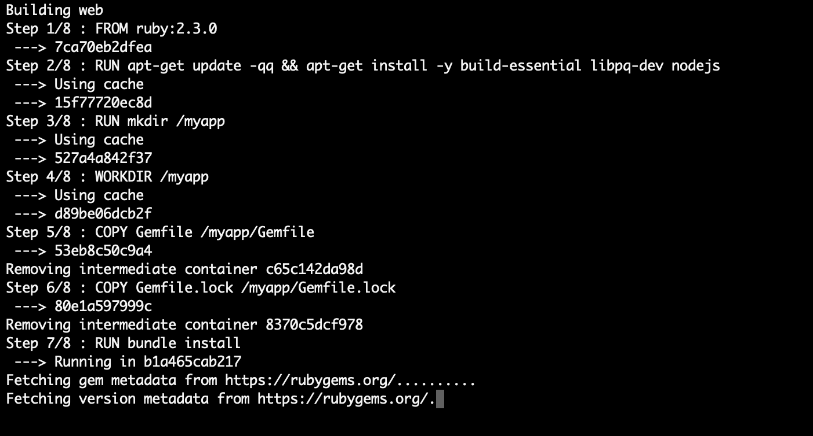
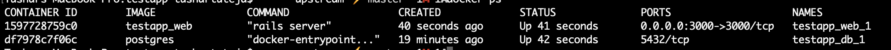

<!-- PROJECT LOGO -->
 

  

  <h3 align="center">Ruby</h3>

  

    This is an application that I'm developing to practice Ruby on Rails
     
     
    More information about the developer:
     
    <a href="https://www.linkedin.com/in/leonidasyopan/" target="_blank">LinkedIn</a>
    ·
    <a href="https://twitter.com/leonidasyopan" target="_blank">Twitter</a>
    ·
    <a href="https://www.facebook.com/leonidasyopan" target="_blank">Facebook</a>
    ·
    <a href="https://leonidasyopan.com/" target="_blank">Portfolio</a>
  

# README

This is an example repository for working with rails and postgres, and setting them up using docker-compose.

To run this app, do the following. 

1. Install docker
1. Run `docker-compose up`
2. This would run the web service in a container and postgres in a container. 
3. Would look something like this.

4. This would take a while the first time. 
5. Now we need to create db before we can go any further. For this we'll connect to the docker container. 
	6. In another terminal run `docker ps`
	7. 
	8. Copy the container id for web, and connect to container by running this command. `docker exec -it 1597728759c0 sh`
	9. You'll be connected to the docker container. 
	10. Run `rake db:create && rake db:migrate`
6. Go to [http://localhost:3000/](http://localhost:3000/) and see if everything is working. 
7. Run all your rails commands in the container itself. 
8. Try running `rails g scaffold blog title:string body:string`
9. Go to [http://localhost:3000/blogs](http://localhost:3000/blogs) and see if everything works. 
10. 

 	
[ just testing ]

<!-- LICENSE -->
## Licença

Distribuído sob a licença MIT. Veja `LICENSE` para mais informações.

<!-- CONTACT -->
## Contato

Leônidas Yopán - [@leonidasyopan](https://twitter.com/leonidasyopan) - leonidasyopan@gmail.com

LinkedIn: [https://www.linkedin.com/in/leonidasyopan/](https://www.linkedin.com/in/leonidasyopan/)
